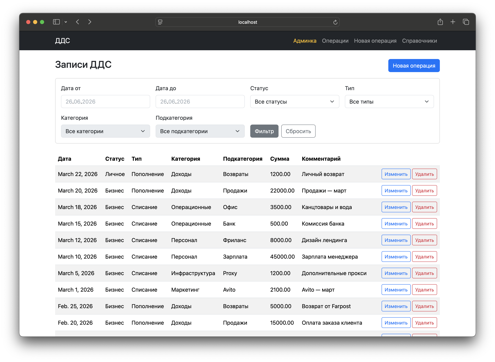
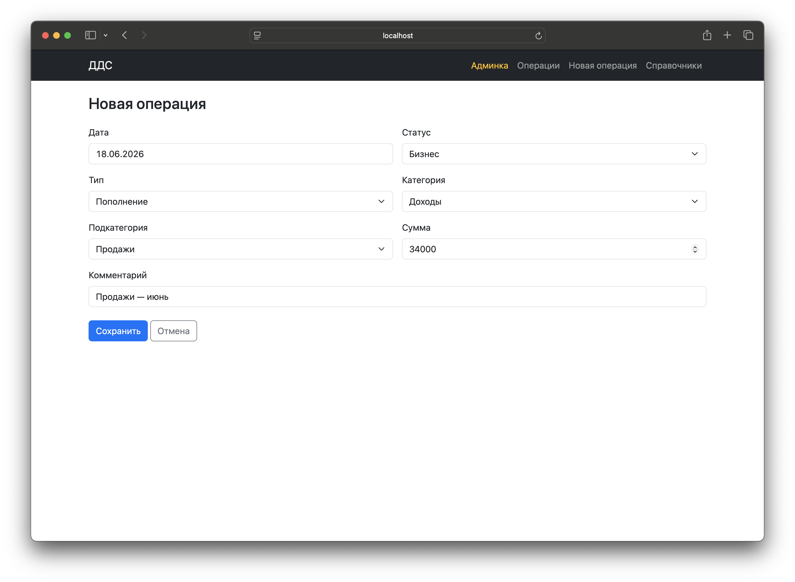
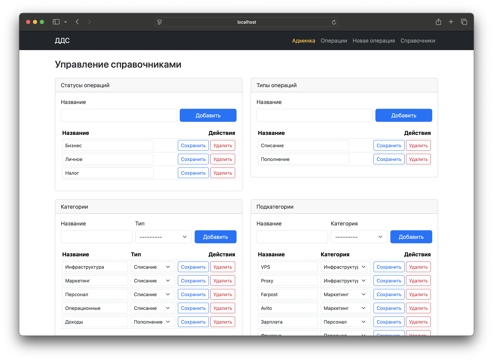

<p align="center">
  
  
  
</p>


# Cash Flow Management

[](https://github.com/RedGradient/cash-flow-management/actions/workflows/tests.yml)
[](https://codecov.io/gh/RedGradient/cash-flow-management)

Демо-проект для управления денежными потоками на Django. Позволяет создавать, читать, обновлять и удалять транзакции с категориями и подкатегориями. Доступ к транзакциям есть как через кастомный UI, так и через админку Django (создание суперпользователя и авторизация не требуются).

## Быстрый запуск (docker compose)

```bash
make up
```

Команда создаёт `.env` из `.env.example` (если файл ещё не существует) и запускает приложение и PostgreSQL в Docker.

После запуска:

- приложение: <http://127.0.0.1:8000/>
- админка: <http://127.0.0.1:8000/admin/>


## Стек

- Python 3.12
- Django 6
- Django REST Framework
- PostgreSQL 16
- Docker / Docker Compose

## Функционал

- Работа с данными через кастомный веб UI или админку Django - на выбор
- Полный CRUD всех моделей
- Валидация полей форм
